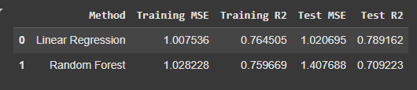
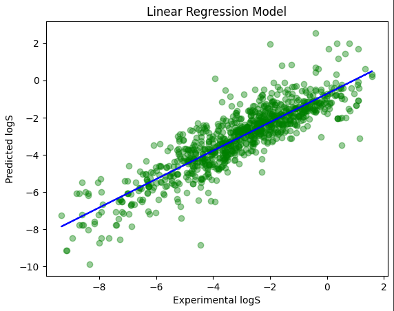
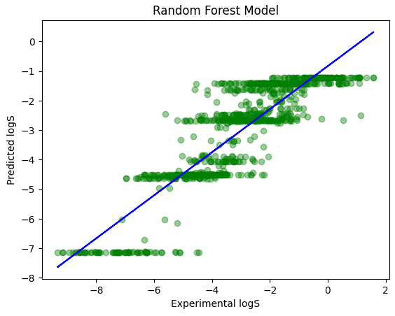

# Projeto: Predição de Solubilidade de Moléculas usando Machine Learning

Este projeto tem como objetivo prever a solubilidade de moléculas (`logS`) com base em suas características físico-químicas, utilizando técnicas de Machine Learning. O dataset utilizado contém informações como peso molecular, proporção de átomos aromáticos, entre outras.

---

## Descrição do Projeto

O dataset utilizado contém as seguintes colunas:
- `MolLogP`: Coeficiente de partição octanol-água.
- `MolWt`: Peso molecular.
- `NumRotatableBonds`: Número de ligações rotacionais.
- `AromaticProportion`: Proporção de átomos aromáticos.
- `logS`: Solubilidade (variável alvo).

O projeto inclui:
- Pré-processamento dos dados.
- Treinamento de modelos de Machine Learning (Regressão Linear e Random Forest).
- Avaliação dos modelos usando métricas como RMSE e R².

O projeto inclui a comparação de dois modelos de Machine Learning:

Tabela Organizada

Interpretação dos Valores
1. Regressão Linear
MSE de Treino: 1.007536

O erro quadrático médio no conjunto de treino é de aproximadamente 1.008.

R² de Treino: 0.764505

O modelo explica 76.45% da variabilidade dos dados no conjunto de treino.

MSE de Teste: 1.020695

O erro quadrático médio no conjunto de teste é de aproximadamente 1.021.

R² de Teste: 0.789162

O modelo explica 78.92% da variabilidade dos dados no conjunto de teste.

2. Random Forest
MSE de Treino: 1.028228

O erro quadrático médio no conjunto de treino é de aproximadamente 1.028.

R² de Treino: 0.759669

O modelo explica 75.97% da variabilidade dos dados no conjunto de treino.

MSE de Teste: 1.407688

O erro quadrático médio no conjunto de teste é de aproximadamente 1.408.

R² de Teste: 0.709223

O modelo explica 70.92% da variabilidade dos dados no conjunto de teste.

## Visualização de Dados

### Comparação dos Modelos
O gráfico abaixo compara as previsões dos modelos de Regressão Linear e Random Forest com os valores reais:

